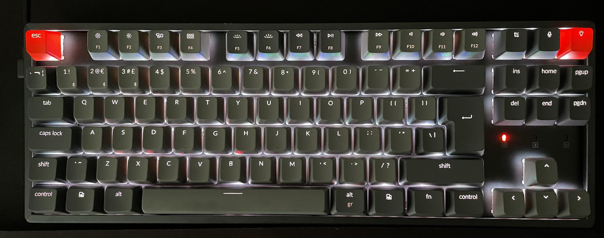
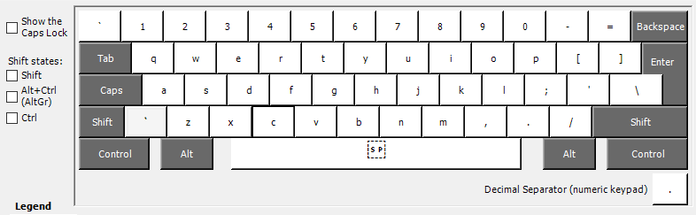
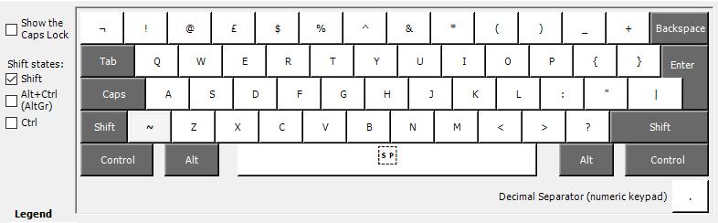
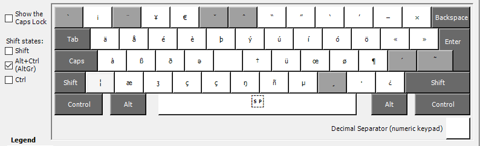

# Windows-qwerty-iso-layout

How to use a **ISO layout keyboard** (like this one) on Windows **natively** ? 

**YOU CAN'T**

*Hence this repo.*

# TL;DR QUICK INSTALL HERE

The compiled exes to directly install it are available under the *dist* folder, just install the one for your architecture (*probably uk001_amd64.msi*)

# Explanations / setup

You have to build your own layout with a tool named [Microsoft Keyboard Layout Creator](https://www.microsoft.com/en-us/download/details.aspx?id=102134) (or available in this repo under the *MKLC* folder).

Once there you can create your fully custom layout, compile it, install it and start using it.

My source file is available under the *layout_source* folder.

Here is what it looks like :

## Normal layout

## Shift layout

## ALT GR layout

# Useful links
Thanks a lot [ZOLID](http://zolid.com/uk-intl-kb/index.htm) for their tutorial on how to achieve this.
[Complete Character List for UTF-16](https://www.fileformat.info/info/charset/UTF-16/list.htm)
[How to change keyboard layout on Windows 10](https://www.windowscentral.com/how-change-your-keyboard-layout-windows-10)